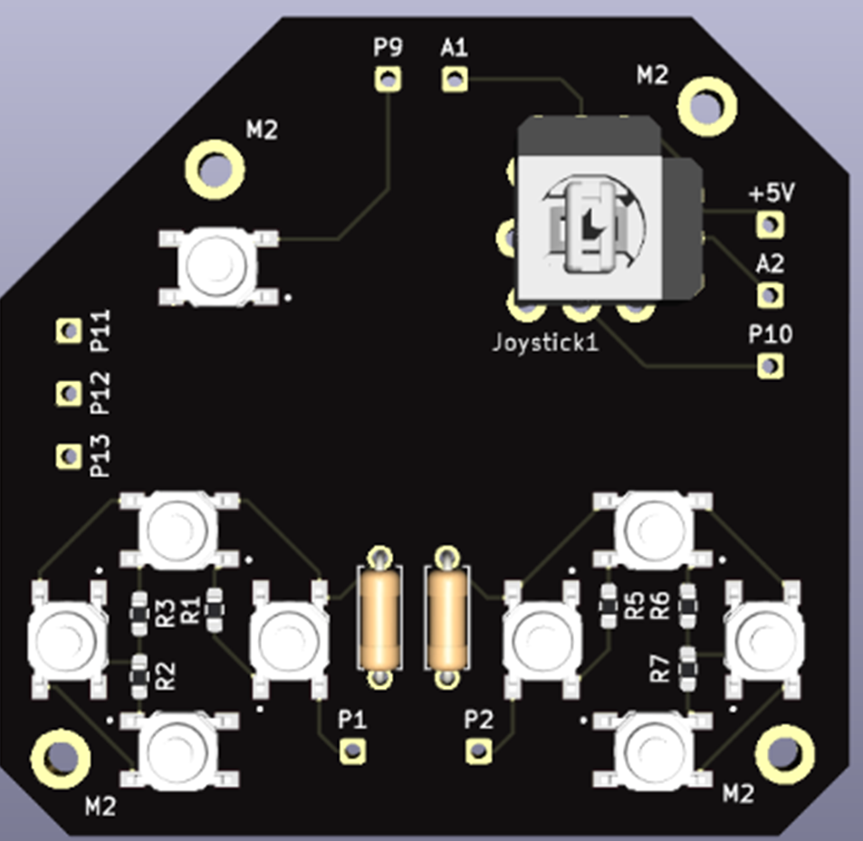

# Graduation Project: DIY Modular Joystick with Hall Sensors

This repository contains the materials and resources related to my graduation project: the development of a modular DIY joystick designed for flight simulators, focusing on personalization and immersive gameplay. 
The project integrates 3D printing, CAD modeling, ESP-WROOM-32 / Arduino Pro Micro programming, and PCB development using KiCad. 
The modularity allows for future enhancements, positioning this joystick as an alternative for DIY enthusiasts in the flight simulation community.

## Project Overview

The goal of this project was to create a customizable joystick for flight simulators, emphasizing durability and precision using Hall sensors. 
The joystick is designed with modular components, enabling the user to upgrade and modify the design to suit individual needs.

### Key Features:
- **3D-printed components** designed in **Fusion 360**
- **PCB design** using **KiCad**
- **ESP-WROOM-32 / Arduino Pro micro** microcontroller programming with 12-bit or 10-bit ADC for high precision
- **Hall effect sensors** (SS495A) for enhanced accuracy
- Custom-built **dual-stage trigger** and **yaw axis** for improved realism

## Repository Content

1. **Step Models**: 3D models of main components (STEP files)
2. **StickControl**: Code for calibrating and controlling the joystick via ESP-WROOM-32 / Arduino Pro Micro
3. **Content-images-vids-gifs**: Visuals of the joystick, including a video demonstrating its testing process

### Top part enclosure:

  
  

### Grip design:

### Yaw axis control mechanism:

  
  
  
  
  

### Gimbal mechanism:

  
  
  

### Lead screw mechanism:

  
  
  

### PCB design:

  
  

### Testing process on War Thunder game:

  <video width="400" controls>
    <source src="Content-images-vids-gifs/test-stick.mp4" type="video/mp4">
    Your browser does not support the video tag.
  </video>

